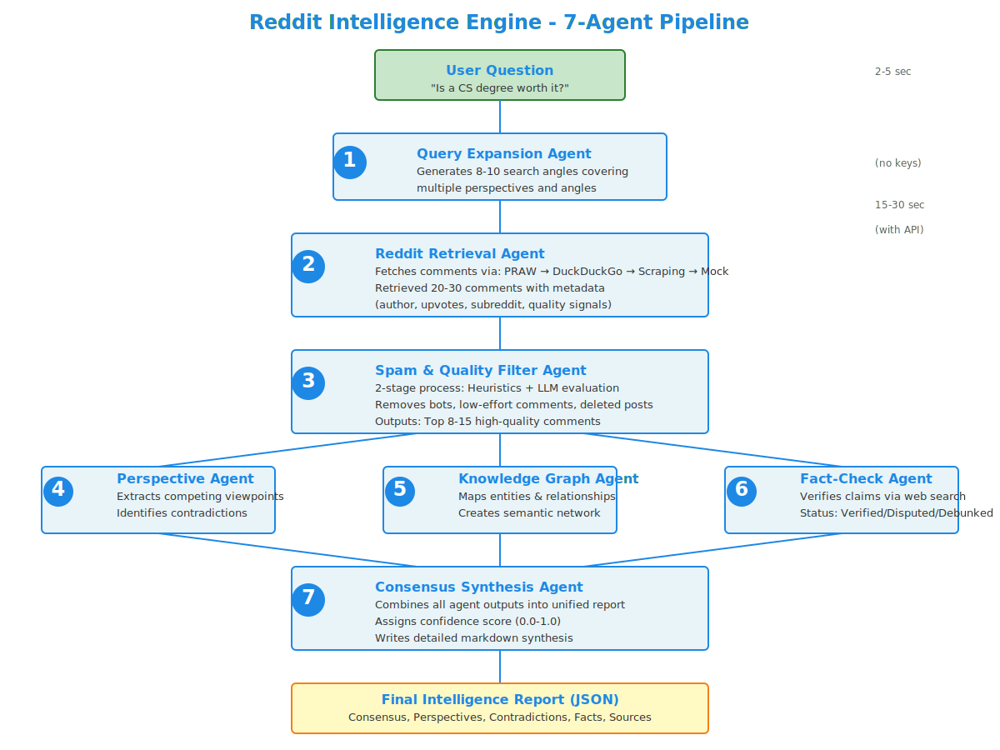

# Reddit Intelligence Engine

[](https://python.org)
[](https://fastapi.tiangolo.com)
[](https://react.dev)
[](LICENSE)
[](https://github.com/smafnan/reddit-answer-bot/releases)

A multi-agent system that synthesizes community consensus from Reddit discussions. Ask any question and get an intelligence report — complete with perspectives, fact-checks, contradictions, entity graphs, and a confidence-scored synthesis.

---

## Pipeline Architecture

The system runs **7 specialized agents** in sequence, with three agents running in parallel for maximum efficiency:

<p align="center">
  
</p>

| # | Agent | Function |
|---|-------|----------|
| 1 | **Query Expansion** | Generates 8–10 search angles covering multiple perspectives |
| 2 | **Reddit Retrieval** | Fetches comments via PRAW → DuckDuckGo → Scraping → Mock fallback |
| 3 | **Spam & Quality Filter** | 2-stage heuristics + LLM evaluation; removes bots, low-effort, deleted posts |
| 4 | **Perspective Analysis** | Extracts competing viewpoints and identifies contradictions |
| 5 | **Knowledge Graph** | Maps entities and relationships into a semantic network |
| 6 | **Fact-Check** | Verifies claims against live web search; marks Verified/Disputed/Debunked |
| 7 | **Consensus Synthesis** | Combines all outputs into a unified, confidence-scored intelligence report |

---

## Features

- **7-Agent LangGraph pipeline** with real-time SSE streaming
- **Live knowledge graph** — interactive, force-directed, perpetually floating nodes
- **Three themes** — Dark Mode, Light Mode, and a nostalgic **Windows 98 desktop**
- **Fully responsive** — works on iOS, Android, tablets, and desktop
- **Collapsible panels** — collapse the sidebar and source threads for focused reading
- **Multiple retrieval backends** — PRAW, DuckDuckGo search, old.reddit.com scraping
- **Hybrid LLM support** — Groq (default) with Gemini fallback
- **Works without API keys** — falls back to intelligent simulated responses

---

## Quick Start

### Backend

```bash
cd backend
pip install -r requirements.txt

# Copy and configure environment
cp .env.template .env
# Edit .env with your API keys (Groq or Gemini)

python main.py
```

The API server starts at `http://localhost:8000`.

### Frontend

**Option A — Direct HTML (no setup):**
Just open `INTERACTIVE_UI.html` in your browser while the backend runs.

**Option B — React app:**

```bash
cd frontend
npm install
npm run dev
```

Opens at `http://localhost:5173`.

---

## API Reference

| Method | Endpoint | Description |
|--------|----------|-------------|
| `GET` | `/` | Health check |
| `GET` | `/api/query?q=QUESTION` | SSE stream of agent progress → final report |
| `GET` | `/api/reports` | List all saved reports |
| `GET` | `/api/reports/{id}` | Get a specific report |
| `DELETE` | `/api/reports/{id}` | Delete a report |
| `DELETE` | `/api/reports` | Delete all reports |

### Example query

```bash
curl -N "http://localhost:8000/api/query?q=Is%20a%20CS%20degree%20worth%20it?"
```

Returns a Server-Sent Events stream:

```
data: {"step": "query_expansion", "message": "Generating alternative search angles..."}
data: {"step": "retrieval", "message": "Querying Reddit discussions..."}
...
data: {"step": "completed", "data": { "... full report ..." }}
```

---

## Themes

The UI supports three themes selectable from the sidebar footer:

| Theme | Description |
|-------|-------------|
| **Dark Mode** | Sleek, modern dark UI with neon violet/cyan accents |
| **Light Mode** | Clean light theme with improved contrast for readability |
| **Windows 98** | Full retro desktop simulation — start menu, taskbar, window frames, classic grey palette |

> **Tip:** In Dark or Light mode, a nostalgic prompt suggests trying Windows 98 mode. Dismiss it to never see it again.

---

## Configuration

Copy `backend/.env.template` to `backend/.env` and set these optional keys:

| Variable | Required | Description |
|----------|----------|-------------|
| `GROQ_API_KEY` | No (fallback to simulated) | Groq LLM (fast, free tier available) |
| `GEMINI_API_KEY` | No | Google Gemini LLM |
| `REDDIT_CLIENT_ID` | No | Reddit API client ID |
| `REDDIT_CLIENT_SECRET` | No | Reddit API client secret |
| `PORT` | No | Server port (default: 8000) |

Without API keys, the system uses intelligent simulated responses for testing and demo.

---

## Tech Stack

**Backend**
- FastAPI + Uvicorn
- LangGraph (agent orchestration)
- Groq / Google GenerativeAI
- PRAW / DuckDuckGo-Search / Requests

**Frontend**
- React 19 + TypeScript
- Vite 8
- Custom force-directed physics graph (no external libs)
- CSS-only theming system

---

## License

MIT License — see [LICENSE](LICENSE).
